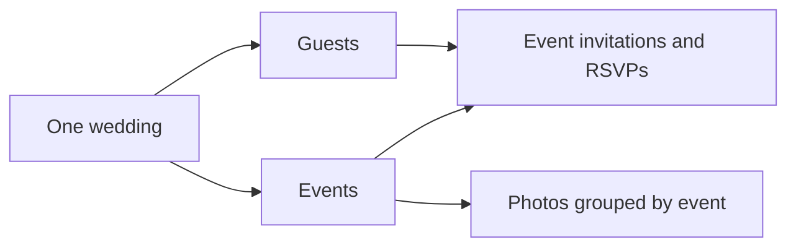

# Make My Marriage

## Database Design — Plain-language Guide

**Version:** 1.2  
**Updated:** 24 September 2026  
**Status:** Proposed design for review  
**Planning target:** One wedding, 1,000 events, and 1,000 unique guests  
**Next step:** Review the API design, then UI/UX

This document explains what we store, how the information connects, and what happens when someone uses the app. Detailed field types, indexes, and background-job rules are in the separate [Technical Reference](Make-My-Marriage-Database-Technical-Reference.md). You can review the main design here without reading that reference.

### 1. Where does our data live?

| Place | What we keep there | Example |
| --- | --- | --- |
| MongoDB Atlas | Wedding details, accounts, guests, events, RSVPs, expenses, photo information, and email progress | “Aarav is attending the reception” |
| Cloudflare R2 | Original photos, smaller previews, and thumbnails | The actual uploaded wedding photo |

MongoDB remembers which photo belongs to which event and where the file is stored in R2. It does not hold the image files themselves.

A few words used below:

| Word | Simple meaning |
| --- | --- |
| Collection | A group of similar records, such as all guests |
| Document or record | One saved item, such as one guest |
| Field | One detail, such as a guest's email |
| ID | A unique reference number used to connect records |
| Index | A lookup guide that helps find records or prevent duplicates |

### 2. What does 1,000 events and 1,000 guests mean?

We are designing for **1,000 events and 1,000 unique guests within one wedding**. A guest is saved once, even when invited to several events.

| Example | Guest records | Event records | Guest-event invitation records |
| --- | ---: | ---: | ---: |
| Each guest is invited to 5 selected events | 1,000 | 1,000 | 5,000 |
| Every guest is invited to every event | 1,000 | 1,000 | 1,000,000 |

We create an invitation record only when a guest is assigned to an event. We do not automatically create all possible combinations.

These are planning targets, not a claim that the app is already tested at this size. They also do not specify how many people will visit at the same time.

**Database plan:** Keep Atlas Free for development. Before live use at the full target, measure the data and indexes and test the main workflows. Free currently allows 0.5 GB of database storage, including indexes, with no automatic storage expansion. The larger workload may need a paid tier; that choice remains open. [MongoDB's Free limits](https://www.mongodb.com/docs/atlas/reference/free-shared-limitations/)

### 3. The main collections

There are nine collections directly connected to product features. The names in code are shown so the document stays useful during development.

| Collection | One record represents | Main details saved |
| --- | --- | --- |
| `weddings` | Our single wedding | Couple names, wedding date, time zone, website content, YouTube link, reminder settings |
| `users` | One staff account | Name, email, protected password hash, admin/organizer role, account status |
| `authTokens` | One temporary account action | Staff invitation, email verification, or password reset; expiry and whether it was used |
| `events` | One wedding event | Name, date/time, venue, RSVP deadline, reminder date, gallery upload setting |
| `guests` | One individual guest | Name, mandatory email, active/removed status |
| `eventInvitations` | One guest invited to one event | Guest ID, event ID, RSVP answer, scheduled-reminder progress |
| `accessLinks` | One sharing or personal invitation link | Link purpose, guest if applicable, active/revoked status |
| `expenses` | One expense | Description, optional event, amount, paid amount, and currency; payment status is calculated |
| `mediaAssets` | One uploaded image | Event, original file location, thumbnail/preview locations, upload/deletion status |

**Guests are not staff accounts.** They use links and QR codes without signing up or logging in. Their email is still mandatory so we can send invitations and reminders.

The wedding website uses the `weddings` record and website images in `mediaAssets`. Each event acts as a gallery folder, so we do not need another album collection. Sample event-planner listings remain sample data for now. Task planning and budget planning remain outside scope.

### 4. How guests, events, and RSVPs connect

Consider one guest, Aarav, invited to the ceremony and reception:

| Saved item | Example |
| --- | --- |
| Guest | Aarav, `aarav@example.com` |
| Event 1 | Ceremony |
| Event 2 | Reception |
| Invitation 1 | Aarav → Ceremony → Attending |
| Invitation 2 | Aarav → Reception → Pending |

Aarav has **one guest record and two invitation records**. His answer for the ceremony does not change his answer for the reception.

Important rules:

- A guest-event pair can exist only once. Clicking “Add guest” twice must not create duplicate invitations.
- Each invitation starts as `pending`; the guest can answer `attending` or `declined`.
- A personal invitation link shows only that guest's assigned events and responses.
- Editing a guest's email does not erase their RSVPs.
- Two individual guests may share an email address. We show a duplicate warning but keep their invitations separate.
- The dashboard distinguishes **unique guests** from **event invitations**. One person invited to five events is still one guest.

### 5. Staff accounts and sharing links

Staff accounts support the agreed invitation-only sign-up, email verification, login, and forgot/reset password flows. There are two admin accounts for the couple and the organizer role.

| Access type | What it permits |
| --- | --- |
| Admin account | Full wedding management, including expenses, access settings, reminders configuration, and photo deletion |
| Organizer account | Event, guest, invitation, and RSVP management; gallery use; no admin-only changes |
| Personal guest link | That guest's invitation details and event RSVPs |
| Wedding website link | Shared wedding website content |
| Gallery link or QR code | Browse event albums, upload photos, and download originals |

Account verification/reset links expire and can be used only once. Passwords are stored as protected hashes, never readable text. The proposed session check makes previous logins invalid after a password reset or account revocation.

Shared wedding/gallery links stay usable until revoked or replaced. A QR code points to a link; it is not another account. An event QR code opens that event's album first, but does not make it a private album.

### 6. How photos are stored

For each photo we keep:

| Information in MongoDB | Purpose |
| --- | --- |
| Event ID | Places the photo in the correct event folder |
| Original file location in R2 | Preserves the uploaded original for downloading |
| Thumbnail and preview locations | Makes the gallery faster to browse |
| File type and size | Checks upload limits and supported formats |
| Upload/processing status | Shows whether the file is ready or still being prepared |
| Uploaded/deleted timestamps and actor reference | Records the action; a guest link does not prove a person's identity |

The flow is **upload → validate → show accepted photo → finish previews**. No manual photo approval is required. A photo can appear with a processing placeholder while its preview is prepared.

Original photo bytes remain unchanged. We create separate, smaller images for browsing. The existing starting limits remain 50 MB per photo and 20 selected files, supporting JPEG, PNG, HEIC, and HEIF; professional RAW formats are excluded.

Only admins can delete photos. Deletion removes the original and its previews from R2, then marks the database record as deleted. If removal fails, the system remembers the unfinished work and retries. Background processing must not bring back a deleted photo.

Renaming or cancelling an event does not automatically delete its photos. Accepted photos have no automatic age-based deletion. Separate photo backup remains deferred.

### 7. Invitations, email batches, and reminders

One “Send invitations” action can select all 1,000 guests. Each guest receives their own email with their personal link. The website shows their assigned events in pages, so we do not put hundreds of event details into one email.

Sending to 1,000 guests means **1,000 personalized emails**, even if the database contains many more guest-event assignments. Resend supports up to 100 emails per batch, so that send can be split into 10 batches. Sending speed still depends on the account's quotas and rate limits. [Resend batch API](https://resend.com/docs/api-reference/emails/send-batch-emails)

For RSVP reminders:

1. Save an RSVP deadline for each event.
2. Check daily for reminders due seven calendar days before that deadline.
3. Select invited guests whose answer is still pending.
4. Save which event reminders are being sent, so a repeated job does not start them again.
5. Group events into one reminder per guest when practical, with a link to their complete event list.
6. Record whether the provider accepted the email and whether delivery later succeeded or failed.

This is **one scheduled reminder per guest-event invitation**, not a weekly reminder forever. Manual reminders remain available separately. The exact daily run time and late/deadline-change behavior are still proposed defaults for review.

### 8. Background records: why do we need them?

These supporting collections let the app remember unfinished work. You do not need to manage them manually. The API design adds one proposed collection for bulk assignment progress.

| Collection | Plain-language purpose |
| --- | --- |
| `emailOperations` | Remembers one Send action and its selected recipients |
| `emailMessages` | Tracks each guest's individual email and result |
| `emailBatches` | Groups emails for sending and remembers retries |
| `outboxEvents` | Remembers work saved in MongoDB that still needs to reach Inngest |
| `providerEvents` | Records delivery updates from Resend without processing duplicates |
| `backupRuns` | Records when database backups ran and whether they succeeded |
| `schemaMigrations` | Records database structure updates as the app evolves |
| `assignmentOperations` (proposed API addition) | Remembers selected guests/events and progress when creating many event assignments |

For example, if sending stops after four batches, these records help resume the remaining work. If a provider response is unclear, the system checks it instead of blindly sending again. This reduces duplicates; it does not promise that separate services can never fail between steps.

### 9. Keeping the larger dataset manageable

We keep each guest, event, invitation, and photo as a separate record. We do not put every guest or photo inside one large wedding record.

| Design choice | Why it matters at this size |
| --- | --- |
| Show lists in pages | Screens do not download 1,000 events or a million invitation records at once |
| Start with 50 results per page; allow up to 100 | Proposed, adjustable API defaults for bounded responses |
| Index common lookups | Find an event's guests, a guest's RSVPs, or an album's photos efficiently |
| Calculate dashboard counts in the database | Avoid downloading whole collections just to count them |
| Process large assignments and reminder scans in chunks | Work can pause and resume without restarting everything |
| Limit parallel email and photo jobs | Stay within service quotas and memory limits |

Before full-scale use, test both a typical assignment pattern and the maximum 1,000,000 guest-event combinations. Measure storage including indexes, list loading, RSVP updates, dashboard counts, reminder processing, and a 1,000-recipient test send. These tests have not been run yet. Photo volume, peak simultaneous users, and response-time targets remain to be agreed.

### 10. Data rules and backups

| Rule | Example |
| --- | --- |
| Validate saved information | A guest needs a valid email; an invitation must reference a real guest and event |
| Store dates consistently | Save precise timestamps in UTC and display wedding times in the configured zone; `Asia/Kolkata` is proposed |
| Store money in the smallest currency unit | If INR is selected, ₹1,250.50 is stored as 125050 paise to avoid rounding errors |
| Detect conflicting edits | If two staff members change the same record, do not silently overwrite the newer change |
| Check access on the server | Hiding a Delete button alone does not prevent unauthorized deletion |
| Keep history when removing planning items | Proposed: mark a guest removed or event cancelled/archived; preserve RSVPs and photos |
| Clean up temporary records carefully | Expired reset links can be cleared; accepted photos are never removed by an expiry timer |

Database backups run **weekly during development** and **daily before live use**. Atlas Free does not include managed backups, so the backup runner, destination, and retention still need to be selected. [Atlas backup limits](https://www.mongodb.com/docs/atlas/reference/free-shared-limitations/)

A database backup contains photo references, not the R2 image files. Restoring it cannot restore a deleted original photo. Recovery must also prevent old email jobs and revoked links from becoming active again.

### 11. What is agreed and what remains open?

| Agreed for this design | Still to finalize before implementation/live use |
| --- | --- |
| One wedding, 1,000 events, 1,000 unique guests | Actual event assignments, photo volume, and peak visitors |
| MongoDB Atlas; Free as the development starting point | Whether the full live workload needs a larger tier |
| Guests use links, with mandatory email | Proposed token durations and detailed recovery behavior |
| Event-level invitations and RSVPs | Rules for reinstating withdrawn invitations and cancelled albums |
| Seven-day scheduled reminders | Daily run time, late invitations, changed deadlines, and outage catch-up |
| R2 originals with separate smaller previews | Exact file-size units and HEIC processing validation |
| Weekly development / daily live database backups | Backup location, runner, retention, and restore procedure |

The [API design](Make-My-Marriage-API-Design.md) now describes how screens request, create, and update this data, which actions each role can perform, and what happens when a request fails. UI/UX follows review of that design.

For implementation details, use the [Database Technical Reference](Make-My-Marriage-Database-Technical-Reference.md). Companion documents: [PRD v1.4](Make-My-Marriage-PRD.md) and [System Architecture v1.1](Make-My-Marriage-System-Architecture.md).

### 12. API design addendum — 24 September 2026

The API design proposes `assignmentOperations` to remember a large assignment action: which guests/events were selected, how many combinations are finished, and where to resume after an interruption. It creates only missing invitations. Existing answers stay unchanged, and withdrawn invitations require a deliberate restore action.

Event, guest, and expense creation also receive an internal request ID. If the browser retries after losing its connection, the server can return the record already created instead of making a duplicate. Staff invitation emails use the existing email-operation records for the same purpose.

These are proposed implementation details, not new product features. The original access, photo, expense, and RSVP rules remain in effect. Exact fields and indexes are in the technical reference's API addendum.
