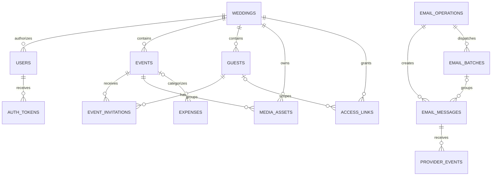
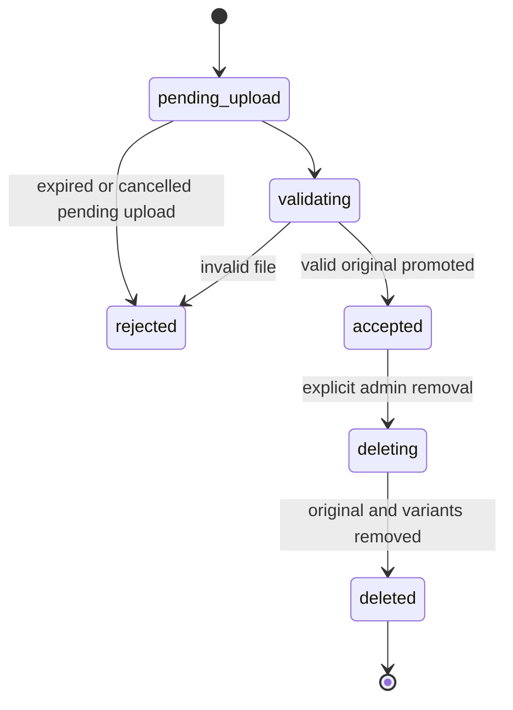

# Make My Marriage

## Database Technical Reference

**Version:** 1.2  
**Date:** 24 September 2026  
**Status:** Proposed implementation design for review  
**Inputs:** Make-My-Marriage-PRD.md v1.4 and Make-My-Marriage-System-Architecture.md v1.1  
**Database:** MongoDB Atlas; Free for development, full-target capacity subject to validation  
**Next stage:** API design, then UI/UX

Start with [Database Design: plain-language guide](Make-My-Marriage-Database-Design.md). This companion preserves implementation details for developers. If wording differs, use the main guide for the current scope and this reference for field definitions and technical rules. Both documents use the same proposed data model. This document defines the proposed MongoDB data model, field types, relationships, indexes, consistency rules, and lifecycle behavior. The product scope and service choices are already agreed. New technical defaults and unresolved product edge cases are identified explicitly. This documentation does not create a database, deploy software, or select a MongoDB access library.

## 1. Design summary

The application stores one wedding, two admin accounts, organizers, individual guests, multiple events, event-level RSVPs, expenses, and image metadata. Its current planning target is 1,000 unique guests and 1,000 events for one wedding. Create guest-event records only for actual assignments: 1,000 guests invited to every event would produce 1,000,000 invitation records. These counts are design targets, not enforced limits or performance guarantees. The database must also remember authorized email operations, sending results, and unfinished background work so retries do not lose work or repeat completed actions.

Use small embedded objects for details owned by a record, such as an event venue or a photo's preview metadata. Use references for independently changing entities: guests, events, staff, invitations, photos, and email messages. Avoid growing arrays of all guests, photos, or email history inside the wedding record.

Original files, thumbnails, and previews live in private Cloudflare R2. MongoDB stores their object references and integrity metadata. Inngest coordinates background execution; MongoDB records durable product intent and results, rather than acting as an always-running worker queue on Vercel.

### Collection inventory

| Collection | Responsibility | Owning module |
| --- | --- | --- |
| `weddings` | Singleton wedding, website content, shared settings | Wedding |
| `users` | Staff identity, credential hash, role, current access, session revocation | Accounts |
| `authTokens` | Invitation, email-verification, and password-reset challenges | Accounts |
| `events` | Event details, RSVP deadline, reminder timing, album identity | Events |
| `guests` | Individual names, mandatory emails, contact revision | Guests |
| `eventInvitations` | Guest-event assignment, RSVP, one scheduled reminder claim | Guests/RSVP |
| `accessLinks` | Long-lived wedding, gallery, and personal invitation capabilities | Access |
| `expenses` | Admin-only cost and payment records | Expenses |
| `mediaAssets` | Gallery and website images, upload lifecycle, R2 references | Gallery/media |
| `emailOperations` | One authorized send action and durable recipient selection | Communications |
| `emailMessages` | One personalized email and its individual outcome | Communications |
| `emailBatches` | Frozen Resend request grouping and retry identity | Communications |
| `outboxEvents` | Durable handoff from saved changes to Inngest | Operations |
| `providerEvents` | Verified Resend callback deduplication and processing | Communications |
| `backupRuns` | Database export execution and recovery metadata | Operations |
| `schemaMigrations` | Applied validator, index, and data migration versions | Operations |
| `assignmentOperations` | Proposed API addition: durable bulk assignment selection and progress; see section 16 | Guests/RSVP |

The operational collections support already requested reliability; they do not add user-facing features. There is no task or budget collection. Sample planner listings remain a clearly labeled fixture file until real planner persistence is requested. A separate album collection is unnecessary while one event equals one gallery folder.

## 2. Conventions and shared types

| Convention | Rule |
| --- | --- |
| IDs | BSON `ObjectId`, generated server-side; references use the same type |
| Wedding singleton | `weddings.singletonKey` must equal `primary`, with a unique index |
| Wedding references | Domain records carry `weddingId`; application queries always scope access appropriately |
| Timestamps | BSON `Date` in UTC for instants; never use the developer machine's time zone for wedding calculations |
| Local calendar dates | Validated `YYYY-MM-DD` strings only where date-only meaning matters |
| Money | BSON 64-bit integer minor units plus ISO currency; never binary floating-point arithmetic for money |
| Mutable records | `createdAt`, `updatedAt`, `schemaVersion`, and `revision` fields; conditional edits increment `revision` |
| Missing optional fields | Omit unless a table explicitly assigns `null` a meaning; especially important for partial unique indexes |
| Email normalization | Trim and case-fold consistently for lookup, preserve display spelling; do not remove dots or plus aliases |
| Actors | Tagged reference: `staff` with user ID, `guest_link` with link ID, or `system` with operation ID |
| Encrypted values | Envelope containing ciphertext, nonce, authentication tag, and key ID; encryption keys remain outside MongoDB |
| Record removal | Explicit lifecycle status and timestamps, with lifecycle-specific cleanup rules below |

`schemaVersion` identifies a document format; `revision` detects concurrent edits. They serve different purposes. In TypeScript, money arithmetic must use an exact representation and safe conversions; API serialization is a later contract decision.

**Proposed practical bounds:** names 200 characters, descriptions/stories 10,000 characters, notes 2,000 characters, and valid email addresses up to 254 characters. These are implementation defaults for review, not extra product features. Validation must cap strings and arrays before persistence.

Persisted records should be validated through Zod at application boundaries and MongoDB validators for key types, required fields, and enum values. Avoid copying request bodies directly into database updates. MongoDB validators and references do not replace cross-record ownership or role checks.

## 3. Relationship model



References in this diagram are enforced by application services and suitable transactions, not SQL foreign keys. A gallery asset requires an event; a website image does not. A personal invitation link requires a guest; a wedding/gallery link does not. Those conditional relationships are defined below.

## 4. Collection definitions

### 4.1 `weddings`

Exactly one document is created through controlled initialization. There is no public create-another-wedding workflow.

| Field | Type / requirement | Meaning |
| --- | --- | --- |
| `_id`, `singletonKey` | ObjectId; literal `primary` | Stable singleton identity |
| `couple.partnerOneName`, `couple.partnerTwoName` | Required strings | Display names |
| `weddingDate` | Optional local-date string while in setup | Wedding date |
| `timeZone` | Required validated IANA zone | Proposed default `Asia/Kolkata`; review before live use |
| `currency`, `currencyMinorUnit` | ISO code; integer | Configured before recording expenses; INR is not inferred automatically |
| `website.story`, `website.venue` | Bounded text; embedded venue object | Fixed-template content |
| `website.imageAssetIds` | Bounded ObjectId array, proposed max 20 | References to ready website-purpose assets |
| `website.template` | Literal `elegant_floral` | Single template |
| `stream.youtubeVideoId` | Optional validated string | Canonical YouTube video reference; no arbitrary embed HTML |
| `reminders.enabled` | Boolean, default false | Admin-controlled global switch |
| `reminders.leadDays` | Literal 7 | Agreed automatic reminder lead time |
| `reminders.localRunTime` | Validated local time | Proposed `09:00`; scheduler configuration must use the same source |
| `reminders.policyVersion` | Positive integer | Identifies policy changes without rewriting sent history |
| `status` | `setup`, `active`, `archived` | Wedding lifecycle; archiving is a proposed administrative operation |

Currency cannot change after expenses exist without an explicit conversion/migration plan. Time-zone changes require recalculating unsent reminder timing and event UTC instants; sent history remains unchanged. Long stories are plain text or a restricted content structure, not trusted HTML.

### 4.2 `users`

This collection is exclusively for staff. Guest email addresses never create users automatically.

| Field | Type / requirement | Meaning |
| --- | --- | --- |
| `weddingId` | Required ObjectId | Single wedding membership |
| `name`, `email`, `emailNormalized` | Required strings | Staff identity; normalized email is unique |
| `role` | `admin`, `organizer` | Assigned only by trusted server logic |
| `adminSlot` | Optional enum `partner_one`, `partner_two` | Required for admins, absent for organizers |
| `status` | `invited`, `pending_verification`, `active`, `revoked` | Current membership state |
| `credential.passwordHash` | Absent before password setup; encoded hash afterward | Vetted adaptive salted password hash, never a recoverable password |
| `credential.changedAt` | Optional Date | Password lifecycle timestamp |
| `emailVerifiedAt` | Optional Date | Required for management access |
| `sessionVersion` | Integer, starts at 1 | Invalidates prior staff sessions when incremented |
| `invitedBy`, `revokedBy` | Optional ObjectId | Staff actor; controlled bootstrap is recorded separately |
| `revokedAt`, `lastLoginAt` | Optional Date | Operational timestamps |

**Session design proposal:** Explicitly use Auth.js JWT sessions with only stable identity and `sessionVersion` claims needed for authorization. Each protected server operation reloads active membership and compares versions; do not trust a role embedded in an old token. Password reset and revocation increment the version. No `sessions` collection is required for this proposal. Validate the final library version before implementation. Auth.js documents that JWT sessions otherwise remain valid until their expiry unless the application adds a revocation check. [Auth.js session strategies](https://authjs.dev/concepts/session-strategies)

The application owns credential-user persistence and account recovery around Auth.js. Do not assume an Auth.js adapter will automatically implement these flows. Do not introduce OAuth account tables unless that scope changes.

The two admin slots are provisioned through an idempotent bootstrap procedure. Unique slot indexes cap admins at two; a validator restricts slot values and requires a slot for admins. After initialization, ordinary organizer-management actions cannot demote, delete, or revoke either admin. Recovering/replacing an admin identity is a controlled operational procedure. Admin roles are never accepted from sign-up request data.

### 4.3 `authTokens`

Short-lived account challenges, separate from guest sharing links.

| Field | Type / requirement | Meaning |
| --- | --- | --- |
| `weddingId`, `userId` | Required ObjectIds | Preauthorized staff target |
| `purpose` | `staff_invite`, `email_verify`, `password_reset` | Exact permitted operation |
| `tokenDigest` | Required string/binary | Verifier for a cryptographically random token |
| `tokenCipher` | Optional encrypted envelope | Temporary recoverable token for queued email delivery only |
| `status` | `active`, `consumed`, `revoked` | Single-use state |
| `expiresAt` | Required Date | Enforced by application checks |
| `sessionVersionAtIssue` | Required integer | Reject obsolete recovery/verification challenges |
| `consumedAt`, `revokedAt` | Optional Date | Lifecycle evidence |
| `purgeAt` | Optional Date | Delayed cleanup after challenge and email reconciliation no longer need it |

Issuing a replacement token revokes the active token of the same purpose in a short transaction. A partial unique index allows only one active challenge per user and purpose. Password reset consumes the token, changes the password hash, increments `sessionVersion`, and revokes remaining active recovery tokens atomically. Sign-up consumes an invitation while transitioning the user to `pending_verification`; email verification consumes its separate challenge before setting `active`.

Challenge duration is configurable; proposed review values are 48 hours for staff invitations, 24 hours for email verification, and one hour for password resets. Check status, purpose, current user state, and expiry even if the database has not yet cleaned up the token.

### 4.4 `events`

| Field | Type / requirement | Meaning |
| --- | --- | --- |
| `weddingId`, `name` | Required | Parent and event title |
| `startsAt`, `endsAt` | Date; optional end | UTC instants derived from entered local time and wedding zone |
| `venue` | Embedded `{name, address, instructions?}` | Event-owned venue information |
| `description` | Optional bounded string | Guest instructions/content |
| `visibility` | `invited_only`, `wedding_link` | Default `invited_only` |
| `status` | `active`, `cancelled`, `archived` | Proposed lifecycle |
| `rsvp.deadlineLocalDate` | Optional local-date string | Date meaningful to the couple |
| `rsvp.deadlineAt` | Optional Date | Proposed end of that local day, converted to UTC |
| `rsvp.deadlineRevision` | Integer | Changes when deadline/zone changes |
| `rsvp.autoReminderEnabled` | Boolean, default false | Admin-controlled despite general event editing being allowed to organizers |
| `rsvp.reminderDueAt` | Optional Date | Derived seven-day reminder run instant for efficient eligibility queries |
| `gallery.acceptUploads` | Boolean, default true | Operational availability, not per-guest permissions |
| `cancelledAt`, `archivedAt` | Optional Dates | Lifecycle metadata |

Require a deadline to enable reminders and validate it does not fall after the event starts. Deadline changes recalculate due time in the same event update. Only admins may change reminder enablement; organizer event-edit inputs cannot smuggle that field through.

The event ID is the logical gallery-folder ID. Renaming an event changes the displayed folder title without moving stored objects. Cancelled/archived events retain photo associations. The final visibility of cancelled-event albums remains a product review item; the baseline preserves existing album access while stopping cancelled-event invitations and automatic reminders.

### 4.5 `guests`

| Field | Type / requirement | Meaning |
| --- | --- | --- |
| `weddingId`, `name` | Required | Individual guest |
| `email`, `emailNormalized` | Required valid email | Delivery address and duplicate detection |
| `contactRevision` | Integer | Changes when destination identity/contact changes |
| `status` | `active`, `removed` | Soft removal from planning |
| `removedAt`, `removedBy` | Optional Date/ObjectId | Removal metadata |

Guest email is indexed but not unique. A confirmed shared mailbox may represent separate individual guests, each with their own invitation and responses. Show a duplicate warning without merging records. Do not store event IDs redundantly on the guest; `eventInvitations` is the relationship authority.

Email edits do not reset RSVPs or silently send new emails. A queued email whose destination no longer matches `contactRevision` must be reviewed/rebuilt before first dispatch; a frozen request cannot be silently changed during retry. Guest removal blocks personal-link access immediately by checking guest state, even before related record cleanup finishes.

### 4.6 `eventInvitations`

One record per guest-event pair, retained across withdrawal/reinstatement.

| Field | Type / requirement | Meaning |
| --- | --- | --- |
| `weddingId`, `guestId`, `eventId` | Required ObjectIds | Relationship |
| `assignmentStatus` | `invited`, `withdrawn` | Active invitation membership |
| `assignedAt`, `withdrawnAt` | Dates as applicable | Assignment history markers |
| `rsvp.status` | `pending`, `attending`, `declined` | Current response, starts pending |
| `rsvp.respondedAt`, `rsvp.updatedBy` | Date and actor when answered | Latest answer attribution |
| `reminder.policyKey` | Literal `seven_day_v1` | Stable logical reminder policy |
| `reminder.state` | `unclaimed`, `claimed`, `accepted`, `delivered`, `failed`, `skipped`, `uncertain` | One scheduled reminder lifecycle |
| `reminder.messageId` | Optional ObjectId | Personalized email claiming this event reminder |
| `reminder.deadlineRevision`, `reminder.dueAt` | Snapshot integer/Date when claimed | Schedule at the time of the claim |
| `reminder.acceptedAt`, `reminder.lastErrorCode` | Optional Date/string | Outcome metadata |

Use a unique index on `(weddingId, guestId, eventId)`. A response update modifies the existing record and uses `revision` for conflict detection. A manipulated event ID never creates an invitation as a side effect of submitting an RSVP.

**Proposed reinstatement rule:** Restoring a withdrawn assignment preserves its previous RSVP and reminder history. Staff can deliberately reset an RSVP to pending with attribution, but cannot implicitly reset a sent scheduled reminder. This avoids accidental repeated emails and is marked for product review.

Dashboard totals derive from invited assignments whose guest and event are active. Joining those states is required; stale soft-removed records must not inflate counts. Unique guest count and event-invitation count remain separate measures.

### 4.7 `accessLinks`

| Field | Type / requirement | Meaning |
| --- | --- | --- |
| `weddingId` | Required ObjectId | Parent |
| `kind` | `wedding`, `gallery`, `guest_invitation` | Capability scope |
| `scopeKey` | Server-derived string | `wedding`, `gallery`, or `guest:<guestId>` |
| `guestId` | Required only for `guest_invitation` | Scoped individual |
| `generation` | Positive integer | Link replacement history |
| `tokenDigest`, `tokenCipher` | Required verifier and encrypted envelope while active | Validate token; securely reconstruct current links for copying/email |
| `status` | `active`, `revoked` | Access state |
| `expiresAt` | Optional Date | No routine expiry is assumed for wedding/gallery links |
| `createdBy`, `revokedBy`, `revokedAt` | Staff IDs and Date as applicable | Audit metadata |

Create a random high-entropy token; use a cryptographic verifier, never the guest ID as the secret. Only trusted server code decrypts active token material. Key material is stored in environment secrets and included in the operational recovery plan, not in database exports alongside ciphertext as plaintext.

A partial unique index permits one active link per `scopeKey`. Rotate by revoking the old generation and creating the next in one transaction. Clear old recoverable token material after it is no longer needed for reconciliation. Old email snapshots may still contain old URLs; their links stay revoked.

Event-folder QR codes combine the current gallery link with an event destination. They do not create another access role or expose an RSVP token. Revocation blocks new permissions immediately after the access check observes it; previously issued object-storage URLs have their own expiry.

### 4.8 `expenses`

| Field | Type / requirement | Meaning |
| --- | --- | --- |
| `weddingId`, `description`, `category` | Required | Expense identity and grouping |
| `eventId` | Optional ObjectId | Link expense to an event |
| `currency`, `currencyMinorUnit` | Required snapshot | Agrees with wedding setting |
| `costMinor`, `paidMinor` | Required BSON long | Nonnegative exact amounts; paid must not exceed cost |
| `notes` | Optional bounded string | Additional information |
| `createdBy`, `updatedBy` | Required admin IDs | Attribution |
| `status`, `deletedAt`, `deletedBy` | `active`/`deleted`; optional metadata | Manual removal |

Compute outstanding amount rather than storing it separately. Proposed payment model remains one cumulative amount-paid field per expense; transaction ledgers and refunds are outside current scope. All reads, aggregations, and mutations are admin-only.

### 4.9 `mediaAssets`

Use one media lifecycle for gallery photos and website photos, with purpose-specific access. This prevents website cover/story photos from becoming an undocumented storage path.

| Field | Type / requirement | Meaning |
| --- | --- | --- |
| `weddingId`, `purpose` | ObjectId; `gallery`, `website` | Owner and access purpose |
| `eventId` | Required for gallery; absent for website | Logical event folder |
| `uploadedBy` | Actor reference | A gallery link identifies capability, not a verified person |
| `upload.selectionId`, `upload.clientFileId` | Required bounded opaque IDs | Retry identity per selected file |
| `upload.pendingKey`, `upload.expiresAt` | Required until finalized | Isolated R2 staging object |
| `upload.expectedSizeBytes`, `upload.declaredMimeType` | Required | Claimed upload constraints, revalidated |
| `original` | Object described below, present once verified | Accepted immutable original |
| `variants.thumbnail`, `variants.preview` | Optional bounded objects | Key, MIME type, dimensions, size, processor version |
| `status` | `pending_upload`, `validating`, `accepted`, `rejected`, `deleting`, `deleted` | Main file lifecycle |
| `processing.status` | `not_started`, `queued`, `processing`, `ready`, `failed` | Variant lifecycle, independent of original |
| `processing.generation`, `processing.errorCode` | Integer; optional string | Prevent stale work overwriting current results |
| `acceptedAt`, `deleteRequestedAt`, `deletedAt`, `deletedBy` | Conditional timestamps/actor | Finalization and manual removal |

`original` contains `objectKey`, `mimeType`, `sizeBytes`, `width`, `height`, `checksumAlgorithm: sha256`, and `checksum`. Store R2 keys, not permanent public URLs or expiring signed URLs. Treat claimed MIME and dimensions as untrusted until file inspection. Original filename is optional display metadata, not an object key.

Use a unique retry key `(weddingId, upload.selectionId, upload.clientFileId)` and validate ownership before returning an existing upload. Generate immutable original destinations from server-created IDs. Pending objects are isolated so reusing an unexpired upload URL cannot overwrite an accepted original. Finalization copies/promotes content through a retry-safe sequence and validates the exact immutable destination bytes before marking the record accepted. Checking only the staging object is insufficient because an unexpired upload URL could replace it between validation and promotion. Storage API mechanics are an implementation validation item.

No automatic age-based deletion or TTL index applies to accepted photos. Rejected or abandoned staged bytes can be cleaned by a worker after verifying status and references. Never rely on deleting a MongoDB record to delete its R2 objects.

Guests and organizers can upload only gallery-purpose assets. Only admins can upload/edit website-purpose images or delete any image. Queries enforce purpose-specific visibility and return projections without tokens, private filenames where unnecessary, or actor identifiers.

### 4.10 `emailOperations`

Represents one authorized send action: invitation batch, manual reminder batch, scheduled-reminder run, or an account email request.

| Field | Type / requirement | Meaning |
| --- | --- | --- |
| `weddingId`, `kind`, `requestedBy` | Parent, enum, actor | Authorization context |
| `requestKey` | Required unique opaque string per wedding | Repeated click/request identity |
| `requestedAt`, `requestPayloadHash` | Date/string | Detect same key reused with different intent |
| `targetRefs` | Bounded array of guest IDs or auth-token IDs | Durable initial selection |
| `selectionLimit` | Integer snapshot | Technical cap; propose 1,000 selected recipients, without a capacity guarantee |
| `status` | `queued`, `preparing`, `sending`, `completed`, `partial_failure`, `failed`, `needs_review`, `cancelled` | Overall status |
| `preparedThrough` | Optional cursor/integer | Resume deterministic recipient expansion |

A send operation may select all 1,000 guests, but stores only a bounded list of recipient references. Prepare messages and assign provider batches in resumable chunks. Never load or embed all 1,000,000 possible guest-event assignments in one operation, transaction, or job payload. Resolve each guest's assignments in bounded pages; cap stored event references at the 1,000-event planning target. Email content should provide a short summary and personal-link access to the paginated event list, not expand 1,000 event details into one body. Exact summary limits belong in API/template design. Operation counts are derived from messages; any cached counts are non-authoritative and must be reconcilable.

### 4.11 `emailMessages`

One intended personalized email per recipient within an operation. A scheduled message may cover several due event invitations for the same guest.

| Field | Type / requirement | Meaning |
| --- | --- | --- |
| `weddingId`, `operationId`, `recipientKey` | Required | Recipient identity within an operation |
| `guestId` or `authTokenId` | Exactly one as appropriate | Email target |
| `kind`, `templateVersion` | Enum/string | Invitation, manual reminder, scheduled reminder, verification, invite, or reset |
| `eventInvitationIds` | Bounded ObjectId array | Events represented in the message, max selected operation scope |
| `contactRevision`, `recipientEmail` | Snapshot fields | Verify destination before first dispatch |
| `status` | `queued`, `preparing`, `ready`, `dispatching`, `accepted`, `delivered`, `bounced`, `failed`, `skipped`, `uncertain` | Individual outcome |
| `payloadCipher`, `payloadHash`, `frozenAt` | Encrypted message snapshot/hash/Date | Exact content once prepared for dispatch |
| `batchId`, `batchOrdinal` | Optional ObjectId/integer | Stable position in a frozen Resend batch |
| `providerEmailId` | Optional unique string | Provider correlation after acceptance |
| `acceptedAt`, `deliveredAt`, `bouncedAt`, `lastErrorCode` | Optional fields | Facts, not an assumption of inbox reading |

A unique `(operationId, recipientKey)` index prevents fanout retries creating two messages. Different guests sharing an email address remain different recipients. Store immutable message content encrypted because it may contain invitation/reset tokens. Never log decrypted content. Remove temporary credential-bearing payloads after their tokens expire and provider reconciliation is complete; preserve minimal outcome/idempotency records.

Before freezing, recheck authorization, current recipient email, pending responses, assignments, and link generation. After a Resend request might have been issued, keep its payload and batch order unchanged on retry. If content needs correction, resolve the old request outcome before creating a new operation; do not silently resend under a new identity.

### 4.12 `emailBatches`

Persists the exact unit of provider retry. Even a single account email can use a one-message batch record with its appropriate provider endpoint.

| Field | Type / requirement | Meaning |
| --- | --- | --- |
| `weddingId`, `operationId`, `batchNumber` | Required | Ordered dispatch group |
| `messageIds` | Required ordered array, maximum 100 | Resend batch request order |
| `transport` | `batch`, `single` | QR attachments are not assumed for batch requests |
| `idempotencyKey`, `payloadHash` | Required | Provider retry identity and immutable request checksum |
| `state` | `ready`, `dispatching`, `accepted`, `failed`, `uncertain`, `needs_review` | Transport lifecycle |
| `firstAttemptAt`, `lastAttemptAt`, `providerKeyValidUntil` | Conditional Dates | Retry safety window |
| `attemptCount`, `nextAttemptAt` | Integer/Date | Bounded backoff |
| `leaseOwner`, `leaseUntil`, `leaseGeneration` | Optional lease state | Atomic worker ownership and fencing |
| `resultRefs` | Bounded ordered provider-result summaries | Maps returned IDs/errors to messages |

Use provider idempotency with stable request content. Resend's retention window is finite; after an unresolved request leaves that window, put it in `needs_review` rather than automatically risking duplicate sends. Resend currently documents a 100-email batch maximum and a 24-hour idempotency window. [Batch API](https://resend.com/docs/api-reference/emails/send-batch-emails), [idempotency keys](https://resend.com/docs/dashboard/emails/idempotency-keys)

All messages in a batch must belong to the same operation/wedding and become assigned to that batch in a short transaction. A unique `(batchId, batchOrdinal)` partial index prevents duplicate positions. Never add or reorder a message after first dispatch.

### 4.13 `outboxEvents`

| Field | Type / requirement | Meaning |
| --- | --- | --- |
| `weddingId`, `dedupeKey` | Required | Unique durable work identity |
| `type`, `aggregateId`, `aggregateRevision` | Required | Work kind and current record reference |
| `payload` | Small IDs/version fields only | No passwords, tokens, full email bodies, or image bytes |
| `state` | `pending`, `publishing`, `published`, `completed`, `needs_review` | Coordinator handoff and completion |
| `availableAt`, `publishedAt`, `completedAt` | Dates as applicable | Scheduling/reconciliation |
| `attemptCount`, `lastErrorCode` | Integer/string | Retry evidence |
| `leaseOwner`, `leaseUntil`, `leaseGeneration` | Optional | Safe atomic claim |
| `purgeAt` | Optional, only after completed retention | Cleanup date |

Write the outbox entry in the same MongoDB transaction as the product change that creates work. Inngest publication happens after commit. Use the stable outbox ID as event identity; handlers also check record state because coordinator deduplication alone is not a permanent business guarantee.

Propose a periodic reconciliation job, interval to be selected, to republish pending entries and inspect published entries lacking progress. This is distinct from the once-daily RSVP eligibility check. No continuously running polling worker is assumed on Vercel.

### 4.14 `providerEvents`

| Field | Type / requirement | Meaning |
| --- | --- | --- |
| `provider`, `providerEventId` | `resend`; stable event identifier | Callback deduplication |
| `providerEmailId` | Required string | Lookup message even if callback arrives before response persistence |
| `type`, `occurredAt`, `receivedAt` | Required | Delivery-event facts |
| `messageId` | Optional ObjectId until correlated | Application message |
| `status` | `pending`, `processed`, `needs_review` | Replay/reconciliation state |
| `safeDetails` | Bounded allowlisted object | Non-sensitive error classification |
| `purgeAt` | Optional after retention | Cleanup |

Verify the provider signature before storing the event. Unknown or early email IDs remain pending for later correlation. Keep independent fact timestamps so an older acceptance callback cannot overwrite a later bounce/delivery fact. Enforce a documented outcome precedence when projecting a single UI status.

### 4.15 `backupRuns`

Fields: `environment` (string), `scheduledFor` (Date), `status` (`running`, `succeeded`, `failed`, `restore_tested`), `startedAt`, `finishedAt`, `snapshotConsistency` (bounded description), `schemaVersion` (document format), `migrationVersion` (latest applied migration ID), `destinationKey` (private reference), `checksum`, `sizeBytes`, `encryptionKeyId`, `lastErrorCode`, and optional `restoreTestedAt`.

This stores database-backup metadata, not exports or photo copies. Use a unique `(environment, scheduledFor)` index to avoid duplicate logical runs. Weekly development and daily production frequency remain operational configuration. Retention and the export runner/destination are still open. Record export manifests with the backup itself as well, so restoring an older database does not erase knowledge of the backup used.

### 4.16 `schemaMigrations`

Fields: stable string `_id` such as `0001_initial`, `checksum`, `status` (`running`, `applied`, `failed`), `startedAt`, `completedAt`, `lastErrorCode`, and optional bounded progress cursor. Use the migration ID's built-in unique index and a controlled migration runner; serialize migrations and make safe reruns explicit.

Do not create indexes or change validators on every request. Apply reviewed, versioned changes during deployment. An already-applied migration is immutable; append a correction instead of changing its recorded checksum.

## 5. Index plan

Every collection already has an `_id` index. Add the following indexes for actual access paths and integrity constraints. `unique` enforces a rule; other indexes support queries. Unique compound indexes enforce combinations across documents. [MongoDB unique indexes](https://www.mongodb.com/docs/manual/core/index-unique/)

| Collection | Index keys | Options / purpose |
| --- | --- | --- |
| weddings | `{singletonKey: 1}` | Unique singleton |
| users | `{emailNormalized: 1}` | Unique staff identity |
| users | `{weddingId: 1, adminSlot: 1}` | Unique, partial `{role: "admin"}`; paired with slot validator |
| users | `{weddingId: 1, status: 1}` | Staff access list |
| authTokens | `{tokenDigest: 1}` | Unique token lookup |
| authTokens | `{userId: 1, purpose: 1}` | Unique, partial `{status: "active"}` |
| authTokens | `{purgeAt: 1}` | TTL, `expireAfterSeconds: 0` |
| events | `{weddingId: 1, status: 1, startsAt: 1, _id: 1}` | Event list |
| events | `{weddingId: 1, status: 1, "rsvp.autoReminderEnabled": 1, "rsvp.reminderDueAt": 1}` | Daily reminder selection |
| guests | `{weddingId: 1, status: 1, name: 1, _id: 1}` | Guest list/pagination |
| guests | `{weddingId: 1, emailNormalized: 1}` | Duplicate warning; deliberately non-unique |
| eventInvitations | `{weddingId: 1, guestId: 1, eventId: 1}` | Unique pair, guest invitation lookup |
| eventInvitations | `{weddingId: 1, eventId: 1, assignmentStatus: 1, "rsvp.status": 1}` | Event counts and pending guests |
| eventInvitations | `{weddingId: 1, eventId: 1, assignmentStatus: 1, _id: 1}` | Stable cursor pagination for an event's guest list |
| accessLinks | `{tokenDigest: 1}` | Unique verifier lookup |
| accessLinks | `{weddingId: 1, scopeKey: 1}` | Unique, partial `{status: "active"}` |
| accessLinks | `{weddingId: 1, scopeKey: 1, generation: 1}` | Unique generation history |
| expenses | `{weddingId: 1, status: 1, createdAt: -1, _id: -1}` | Admin list |
| mediaAssets | `{weddingId: 1, purpose: 1, eventId: 1, status: 1, createdAt: -1, _id: -1}` | Album list, bounded pagination |
| mediaAssets | `{weddingId: 1, "upload.selectionId": 1, "upload.clientFileId": 1}` | Unique upload retry identity |
| mediaAssets | `{"original.objectKey": 1}` | Unique partial where field is a string |
| mediaAssets | `{status: 1, "upload.expiresAt": 1}` | Pending-upload cleanup, not TTL |
| emailOperations | `{weddingId: 1, requestKey: 1}` | Unique authorized request identity |
| emailOperations | `{weddingId: 1, createdAt: -1, _id: -1}` | Sending history |
| emailMessages | `{operationId: 1, recipientKey: 1}` | Unique recipient fanout |
| emailMessages | `{providerEmailId: 1}` | Unique partial where field is a string |
| emailMessages | `{batchId: 1, batchOrdinal: 1}` | Unique partial where batchId is ObjectId |
| emailMessages | `{weddingId: 1, guestId: 1, createdAt: -1}` | Guest communication history |
| emailBatches | `{operationId: 1, batchNumber: 1}` | Unique batch identity |
| emailBatches | `{idempotencyKey: 1}` | Unique provider request key |
| emailBatches | `{state: 1, nextAttemptAt: 1, leaseUntil: 1}` | Retry/reconciliation candidates |
| outboxEvents | `{weddingId: 1, dedupeKey: 1}` | Unique work intent |
| outboxEvents | `{state: 1, availableAt: 1, leaseUntil: 1}` | Publication recovery |
| outboxEvents | `{purgeAt: 1}` | TTL for completed records only |
| providerEvents | `{provider: 1, providerEventId: 1}` | Unique webhook event |
| providerEvents | `{providerEmailId: 1, status: 1}` | Correlation/replay |
| providerEvents | `{purgeAt: 1}` | TTL after safe retention |
| backupRuns | `{environment: 1, scheduledFor: -1}` | Unique schedule and run history |

Partial indexes with optional unique fields avoid treating every missing value as the same unique entry. Validate index filters against the selected MongoDB version and field types. Use query plans before adding speculative search indexes; select the guest/event search behavior during API design and measure its queries against the 1,000-guest and 1,000-event target before adding a separate search service.

TTL cleanup is asynchronous. Expired authentication tokens can remain physically present, so authorization must enforce expiry on every use. `purgeAt` is a cleanup timestamp, not permission validity. Never place TTL indexes on users, wedding records, accepted media, active links, expenses, RSVPs, or permanent scheduled-reminder history. [MongoDB TTL behavior](https://www.mongodb.com/docs/manual/core/index-ttl/)

## 6. Atomic operations and cross-service consistency

MongoDB writes are atomic at the document level; coordinated changes across documents can use transactions. Transactions do not include R2 or Resend. Keep them short and never await network calls to those services inside a transaction. Validate transaction behavior against the actual Atlas cluster in the implementation spike. [MongoDB atomicity](https://www.mongodb.com/docs/manual/core/write-operations-atomicity/)

| Operation | Database boundary |
| --- | --- |
| Save an RSVP | Conditional single-document update matching wedding, invitation, active assignment, and expected revision |
| Accept staff invitation | Transaction: consume valid token, update preauthorized user, create verification work/outbox |
| Reset password | Transaction: consume valid reset token, replace hash, increment session version, revoke stale challenges |
| Rotate guest/gallery link | Transaction: revoke current generation, create next active generation |
| Request invitation send | Transaction: write unique operation and its outbox event |
| Expand email operation | Bounded transactions: upsert deterministic messages, advance preparation cursor, enqueue work |
| Claim scheduled reminders | Transaction per guest/group: conditionally claim unclaimed invitations, create one message, enqueue it |
| Freeze a provider batch | Transaction: bind ordered ready messages to an immutable batch and enqueue dispatch |
| Accept uploaded original | R2 validation/promotion first; transaction stores accepted metadata and variant outbox; reconcile orphan promotions |
| Request image deletion | Conditional admin-authorized update to `deleting`, generation increment, and deletion outbox in a transaction |

Recheck current guest/event/member state in services. For operations requiring strict ordering against concurrent revoke/remove/withdraw actions, serialize through a conditional version/fence write on the affected parent within a bounded transaction, rather than assuming a read-only parent lookup locks it. An operation already authorized and dispatched to an external provider cannot be recalled merely by changing database state.

Workers claim leases with an atomic conditional update and fencing generation; completion must match the same generation. A resumed stale worker cannot overwrite a newer result. A lease only prevents conflicting database claims; provider idempotency and immutable object destinations are still needed for external side effects.

## 7. Scheduled-reminder data rules

The product decision is one automatic reminder seven calendar days before each event's RSVP deadline. Store the editable deadline on the event and a derived due instant for efficient selection. Do not create a recurring weekly reminder per guest.

The daily job finds eligible active events, then invited guests with `rsvp.status=pending`. For each guest, claim due invitations whose scheduled-reminder state is unclaimed, record their current deadline revision, and create one grouped message when practical. Duplicate execution finds existing claims and cannot create a second message for them.

Immediately before first dispatch, recheck eligibility. Remove no-longer-pending invitations from the unfrozen message and mark their claims skipped; if no eligible events remain, skip the email. Once a request is dispatched or uncertain, preserve its frozen contents and resolve the provider result before any new send decision.

Track provider acceptance separately from final delivery. A bounce is not a reason to create another automatic reminder endlessly. An admin can correct contact details and deliberately resend. Manual reminders use separate operations and do not reset or consume the seven-day scheduled entitlement.

**Proposed edge rules, still for product review:**

- Recalculate an unsent reminder when the deadline changes. If the reminder was already accepted, do not issue another automatically merely because the deadline changed.
- Guests invited inside the seven-day window get their initial invitation; further follow-up is manual.
- Keep claimed failed work recoverable, but require review before sending after the RSVP deadline or after an extended outage. The maximum catch-up delay remains configurable and undecided.
- Reinstated assignments preserve sent reminder history. Reopening an RSVP does not create another scheduled reminder.

Pending-state and deadline checks are performed at a defined dispatch point. A guest may answer after that point while an email is in transit; this race cannot be eliminated through database indexes.

## 8. Image lifecycle and deletion rules



Variant processing is a separate state: queued, processing, ready, or failed. The image remains accepted if thumbnail generation fails. Original checksum and immutable destination remain unchanged across preview retries.

Every processing completion checks that the asset is still accepted and its processing generation matches. If an admin deleted the photo while a worker was running, discard or clean up the late-produced variants; never resurrect a deleted record. Persist a small deletion tombstone until outstanding jobs and signed URLs can no longer reference it. Cleanup checks all known object keys and is idempotent.

Deleting the metadata before deleting objects is not sufficient. Retain `deleting` state and retry cleanup when R2 is unavailable. Conversely, reconciliation must identify a promoted original whose database finalization failed and either finish acceptance safely or remove an unreferenced pending promotion; it must not remove an accepted original.

Removing an event does not cascade-delete photos. No guest deletion operation exists. Originals can be downloaded through authorized temporary URLs until manually deleted; share-link revocation prevents new URL issuance but not recall of downloaded bytes.

## 9. Query and access patterns

| Product flow | Query pattern and projection |
| --- | --- |
| Staff dashboard | Aggregate active events/guests/invitations; fetch expenses only for admin |
| Guest invitation | Validate personal link, active guest, and wedding; fetch assigned active event projections and own RSVPs |
| Wedding website | Validate wedding link; return website fields and generally visible event projections |
| Event guest list | Query invitation index by event, join active guest names/emails for staff only |
| Gallery folder list | Event IDs/names and accepted photo counts; omit private schedules, venue instructions, guest contacts |
| Album photos | Paginate accepted gallery assets by event, ordered by `(createdAt, _id)` |
| Original download | Validate gallery/staff access and asset purpose/state, then issue a temporary URL |
| Expense overview | Admin-scoped active expense aggregation using exact minor units |
| Pending reminders | Due-event index followed by pending active invitations and current claims |
| Send-operation progress | Operation plus grouped message outcomes; distinguish acceptance from delivery |
| Reconciliation | Indexed outstanding outbox/batch/provider records with bounded pages |

Use bounded cursor pagination for event lists, guest lists, event guest lists, personal invitation events, gallery folders, photos, and histories. Propose 50 records per page and a server-enforced maximum of 100. Add a stable ID tie-breaker to every ordering. For event guest lists, add an index on `(weddingId, eventId, assignmentStatus, _id)`; use the existing RSVP-status index for filtered counts and validate any additional filter/sort index with query plans. Compute dashboard counts in the database rather than returning all invitations to the browser. Background assignment changes and reminder scans save progress between bounded chunks. Do not include password hashes, token digests/ciphertext, encrypted email payloads, provider credentials, or internal membership data in frontend projections. Album access deliberately permits all shared gallery folders, while personal invitation details stay restricted.

## 10. Example relationship records

The following is illustrative JSON with readable placeholder IDs and dates. Real persisted IDs are BSON ObjectIds and timestamps are BSON Dates. It is not a MongoDB import file and contains no real guest information.

```json
{
  "guest": {
    "_id": "guest-alex",
    "weddingId": "wedding-primary",
    "name": "Alex",
    "email": "alex@example.com",
    "emailNormalized": "alex@example.com",
    "contactRevision": 1,
    "status": "active"
  },
  "eventInvitations": [
    {
      "_id": "invitation-ceremony",
      "weddingId": "wedding-primary",
      "guestId": "guest-alex",
      "eventId": "event-ceremony",
      "assignmentStatus": "invited",
      "rsvp": { "status": "attending" },
      "reminder": { "policyKey": "seven_day_v1", "state": "unclaimed" }
    },
    {
      "_id": "invitation-reception",
      "weddingId": "wedding-primary",
      "guestId": "guest-alex",
      "eventId": "event-reception",
      "assignmentStatus": "invited",
      "rsvp": { "status": "pending" },
      "reminder": { "policyKey": "seven_day_v1", "state": "unclaimed" }
    }
  ]
}
```

Alex is one guest with two event invitations. The ceremony response does not change the reception response. A scheduled reminder checks only the reception's pending state if that event is due. One personal access-link scope still covers Alex's invitation view.

## 11. Retention, backups, and restore safety

| Record category | Policy |
| --- | --- |
| Wedding, guests, events, invitations, expenses | No automatic TTL; retain until an explicit reviewed lifecycle/purge action |
| Accepted originals and photo metadata | No automatic expiry; manual admin deletion only; separate photo backups deferred |
| Auth challenges | Application expiry always enforced; propose cleanup after expiry plus a short reconciliation period |
| Credential-bearing email payloads | Remove after token validity and retry/reconciliation needs end; keep minimal send outcomes |
| Completed outbox/provider records | Proposed finite retention to fit Atlas Free; exact duration to approve before enabling TTL |
| Email outcomes and scheduled claims | Keep sufficient history to prevent duplicate reminders/resends; do not purge solely because a provider key expires |
| Backup/migration records | Retain with recovery procedures and deployment history |

Atlas Free has no Atlas-managed backups. Schedule database exports weekly in development and daily before live use, with a separate protected destination and a tested restore procedure. Export runner, retention, and consistency procedure remain open technical setup items. [Atlas Free limitations](https://www.mongodb.com/docs/atlas/reference/free-shared-limitations/)

Restore into an isolated environment first. Validate schema/index versions, record counts, references, and object availability. Suppress all email jobs and reminder cron execution during restoration. Reconcile email history with provider records before re-enabling sending, because restoring an old snapshot may restore old pending work. Keep backups of required encryption keys through a separate controlled secret-recovery procedure; encrypted tokens/payloads cannot be recovered with database data alone.

Use a deployment-level authentication/share-link epoch in protected environment configuration. Rotate it during production restore or suspected compromise so restored older session versions or link records cannot reactivate access that was revoked after the backup. Reissue necessary staff sessions and guest sharing links deliberately. The exact guest-facing recovery procedure belongs in the operations/API plan.

Database exports contain object references, not original images. No independent photo backup is added by this design. A database restore cannot recover a deleted R2 original.

## 12. Migration and initialization plan

1. Select the MongoDB driver/ODM and verify Atlas Free compatibility with required transactions, validators, and indexes.
2. Create collections and validators using a reviewed migration; build indexes before live data arrives.
3. Initialize the single wedding and the two preauthorized admin slots idempotently, without committing credentials or tokens to source.
4. Use synthetic guest/event data in development and preview. Keep production credentials and live recipients isolated.
5. Add backward-compatible fields with safe defaults, backfill in bounded batches, then enforce stricter validation after data is ready.
6. Before a unique index is added to existing data, find and resolve duplicates; never discard duplicate records without understanding their responses/history.
7. Record applied migration checksums. Deploy compatible application and worker code, then monitor reconciliation.

Database access library remains open. Choosing an ODM does not eliminate Zod validation, database indexes, or explicit authorization. No runtime request should create its own collection schema or indexes.

## 13. Validation scenarios

- Concurrent inserts for the same guest-event pair produce one relationship record.
- Two guests with a confirmed shared email remain independent; duplicate staff account email is rejected.
- Uninvited staff cannot register; sign-up requests cannot set admin roles or bypass email verification.
- Concurrent password-reset requests consume a challenge only once and invalidate prior sessions.
- Link rotation leaves one active generation; previously revoked links stay invalid after restore procedures.
- Concurrent RSVP edits detect stale revisions instead of silently overwriting a later answer.
- Duplicate cron runs claim one scheduled reminder per invitation; deadline edits do not silently resend accepted reminders.
- A failed database-to-Inngest publication is recoverable from the outbox.
- Retried email batches retain the same ordered payload and key; unresolved old requests require review.
- A callback arriving before provider-ID persistence is later correlated without losing the outcome.
- Retried uploads create one asset per selected file; accepted originals cannot be overwritten through old upload permissions.
- Admin deletion racing with preview generation cannot resurrect an image or leave uncontrolled variants.
- Token expiry is enforced even before TTL cleanup; no TTL affects accepted images or active wedding data.
- Unauthorized expense reads and guest-directory queries fail before returning data.
- Restoring a backup does not automatically trigger old emails, revive revoked access, or claim to restore absent photo bytes.
- Validate with synthetic datasets of 1,000 guests and 1,000 events: a typical selected-event assignment pattern and the all-to-all case of 1,000,000 invitation records. Measure document plus index storage, dashboard/RSVP queries, pagination, bulk assignment, reminder scans, and a 1,000-recipient send using test delivery. Record timings, memory, and service quotas; do not send test email to real guests. Agree concurrency and response-time targets before sign-off. If Free capacity is insufficient, test the full dataset on an appropriately sized approved tier. Initial query plans must use intended indexes and all list results must be bounded.

These are design validation requirements. No database, migration, or application tests have been executed as part of this document.

## 14. Decisions for review and API handoff

The following proposals resolve design gaps without changing the agreed primary scope, but should be reviewed before implementation:

| Proposal / open item | Position in this design |
| --- | --- |
| Session strategy | JWT cookies plus server-side active-user/session-version check; validate Auth.js compatibility |
| Event removal | Cancel/archive records, preserve references/photos, stop active event communications |
| Reinstating an invitation | Preserve RSVP and sent reminder history unless explicitly reset |
| Deadline semantics | Date-only input interpreted as end of local day; daily run time still proposed 09:00 India time |
| Late/changed reminders | No automatic repeat after acceptance; catch-up limits need approval |
| Token lifetimes | Proposed 48-hour staff invite, 24-hour verification, one-hour password reset |
| Operational retention | Select durations before enabling cleanup; preserve idempotency and reminder history |
| MongoDB access library | Not yet selected; schemas here are library-independent |
| Image byte units/codecs | Define exact 50 MB threshold and validate HEIC processing in API/implementation planning |
| Backup setup | Select runner, protected destination, retention, and consistent export procedure |

The API design should now define request/response contracts, allowed field updates by role, conflict handling, idempotency-key behavior, upload finalization, signed-link exchange, provider callbacks, and user-visible retry/status semantics against this data model. UI/UX design follows those contracts.

## 15. Capacity update: 23 September 2026

The target is now 1,000 events and 1,000 unique guests in the same wedding. The earlier 10-by-10 baseline and future-only 1,000-recipient example are superseded. These counts do not mean 1,000 concurrent visitors or 1,000 guests per event automatically. Photo volume and peak concurrency remain open.

Atlas Free remains the development starting point. Its documented storage allowance is 0.5 GB including documents and indexes, and it does not automatically expand storage. The all-to-all dataset, indexes, email history, and media metadata must be measured before selecting the live tier; a paid tier may be necessary. No tier upgrade is authorized or performed by this document. [Atlas Free limits](https://www.mongodb.com/docs/atlas/reference/free-shared-limitations/)

An initial invitation send to all guests means 1,000 individual emails. It does not mean one email for each of the possible 1,000,000 event assignments. Group due reminders for a guest when practical, retain each event's reminder tracking, and link to the full personal event list. With batches of 100, 1,000 emails require 10 provider batches; account quotas still determine dispatch timing.

## 16. API design addendum: 24 September 2026

The [API contract](Make-My-Marriage-API-Technical-Reference.md) proposes the following additions for retryable requests and bulk guest-event assignment. They are not implemented migrations.

### `assignmentOperations`

| Field | Type / rule |
| --- | --- |
| weddingId, requestedBy | ObjectId references; requesting active staff member is checked before each chunk |
| requestKey, requestPayloadHash | Required strings; same key with different canonical input is rejected |
| guestIds, eventIds | Sorted distinct ObjectId arrays, each 1..1,000; validate ownership and initial active states |
| state | queued, running, completed, partial_failure, failed |
| totalPairs, processedPairs | Integers; product of selected counts and committed progress |
| createdCount, unchangedCount, skippedCount, failedCount | Integers; sum equals processedPairs |
| nextPairOffset | Integer into deterministic guest/event Cartesian ordering; do not persist all pairs |
| leaseOwner, leaseUntil, leaseGeneration | Worker ownership and fencing, as for other background jobs |
| lastErrorCode, errorCounts | Safe code and bounded per-code counters; no unbounded per-pair result array |
| createdAt, updatedAt, completedAt, revision, schemaVersion | Common lifecycle/version fields; completedAt conditional |

Indexes: unique `(weddingId,requestKey)`; `(state,leaseUntil)` for recovery; `(weddingId,createdAt:-1,_id:-1)` for operational lookup. No automatic TTL until request identity retention is chosen. Create the operation and its outbox event atomically. Proposed processing chunks contain at most 100 pairs; each chunk transaction commits invitation inserts and progress counters together, matching the operation's lease generation and cursor. A retry of a committed chunk observes advanced progress and cannot repeat counts.

Add missing pairs only. Existing invited pairs remain unchanged; withdrawn pairs are skipped, not reactivated. Guest removal or event cancellation stops new assignments to that record. The existing unique pair index and transaction retries resolve concurrent inserts; strict removal ordering follows section 6's parent-state checks/fencing. A permanent chunk failure stops with a code and preserves the cursor rather than falsely counting unprocessed pairs. Progress has at most one active worker generation. This supports a million combinations without one large request payload or transaction. Individual RSVP edits continue normally.

### Create-request identity

Add required internal `clientRequestId` and `createRequestHash` strings to new API-created `events`, `guests`, and `expenses`. Use unique `(weddingId,clientRequestId)` in each collection, partial on string type while migrating older records. Server logic hashes the canonical create input and checks current access before replay: an identical request returns the existing record, while a mismatching hash returns 409. Soft-removed records retain the identity; retry cannot recreate or reactivate them. Omit these fields from normal browser projections. Retain for the record's lifetime pending an approved cleanup policy.

Staff invitation creation/resending uses `emailOperations.requestKey` and its payload hash; the user, new/replaced challenge, email operation, and outbox changes commit together. No additional staff-invitation collection is needed. Invitation and account email histories remain permission-separated.

### Clarifications for API review

- API proposes rejecting wedding time-zone edits after events exist until an explicit rescheduling workflow is designed; it does not silently shift saved times.
- API proposes preserving cancelled/archived album browsing while disabling new uploads.
- Existing date-only deadline, session, token-lifetime, and late-reminder proposals remain subject to review.
- Collection inventory is now 17 including the proposed assignment collection. No collections, indexes, or service configurations have been created by this documentation.
