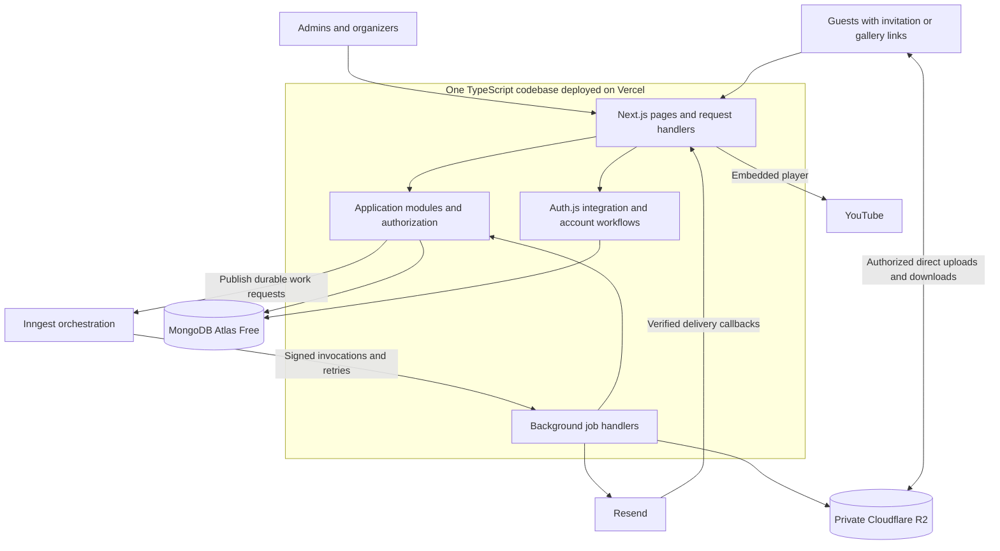

# Make My Marriage

## System Architecture Document

**Version:** 1.0  
**Date:** 21 September 2026  
**Status:** Architecture baseline for review  
**Companion document:** Make-My-Marriage-PRD.md, version 1.3  
**Next design stages:** Database design, API design, then UI/UX

This document records the architecture agreed during discussion. It describes component responsibilities, deployment, access boundaries, background processing, storage, and operations. Detailed collection schemas, indexes, endpoint contracts, and interface designs belong to the following stages. No application deployment or service provisioning is part of this documentation step.

## 1. Product context and constraints

Make My Marriage is a web application for one wedding, with two admins, organizers, and guests who do not create accounts. The initial planning baseline is **10 guests and 10 events**, giving at most 100 guest-event invitations if every guest is invited to every event. These numbers are planning assumptions, not hard product limits.

The primary audience is in India. The guest website has an elegant floral design and is accessible through shared links. Personal invitations expose only a guest's selected events and individual RSVPs. Gallery links and QR codes allow viewing, uploading, and downloading original photos. Only admins can delete photos.

Sending 1,000 invitations is a future example rather than the initial capacity target. The design supports splitting sends into batches, but higher-volume operation will require quota, cost, and performance review. No fixed operating budget has been agreed.

The product includes events, guests, invitations, manual and scheduled RSVP reminders, expenses, organizer management, a sample planner directory, photo galleries, and an embedded YouTube stream. Budget planning, task planning, multiple weddings, native mobile apps, RAW-camera files, and custom video broadcasting remain excluded.

## 2. Decision register

| Area | Selected direction | Status |
| --- | --- | --- |
| Application | Next.js with Node.js runtime | Agreed |
| Language | TypeScript throughout application code | Agreed |
| Architecture | Modular monolith in one codebase | Agreed |
| Input validation | Zod | Agreed |
| Database | MongoDB Atlas Free | Agreed |
| Hosting | Vercel | Agreed |
| Authentication | Auth.js email/password integration with application-owned account workflows | Agreed direction; version and session details require validation |
| Staff onboarding | Invitation-only registration, two preauthorized admins | Agreed |
| Guest access | Scoped personal/shared links and gallery QR codes, no login | Agreed |
| Images | Private Cloudflare R2 storage | Agreed |
| Email delivery | Resend | Agreed |
| Background execution | Inngest coordinating TypeScript jobs hosted with the application | Agreed architecture direction |
| Scheduled RSVP reminder | One reminder seven days before each event's RSVP deadline; daily eligibility check | Agreed |
| Photo formats | JPEG/JPG, PNG, HEIC, HEIF | Agreed |
| Upload limits | 50 MB per photo; 20 files per selection | Agreed; limits configurable |
| Image delivery | Compressed thumbnails and previews; untouched originals available to gallery-link holders | Agreed |
| Photo retention | Manual admin deletion; no automatic expiry | Agreed |
| Separate photo backups | Deferred | Explicit user decision |
| Database backups | Weekly in development; daily before live use | Agreed; runner/storage not yet selected |
| Observability | Basic application, error, and job logs | Agreed |
| Environments | Separate development/testing and production | Agreed |
| Domain | Not purchased; sending domain and reply-to address pending | Open setup item |

Exact dependency versions, commercial plans other than Atlas Free, and optional libraries have not been selected. Official product documentation was checked on the document date; verify compatibility and limits again when implementation begins.

## 3. System overview



**Reading the diagram:** Vercel runs our application and job handlers. Inngest coordinates when job handlers run and retry; it is not the email sender or image store. Resend sends messages. MongoDB holds application records. R2 holds image bytes. The browser reaches R2 only through access authorized by the application.

The application is one logical release with internal feature boundaries. Background handlers reuse the same modules rather than creating separately owned business services. Inngest invokes deployed functions on the chosen compute platform; it does not remove that platform's execution limits. [Inngest deployment model](https://www.inngest.com/docs/platform/deployment)

## 4. Deployment and module boundaries

### Deployment shape

- Use Next.js server functionality on the Node.js runtime for database access, authentication, and integration code.
- Deploy pages, request handlers, and Inngest handlers from the same repository and compatible release.
- Do not assume an always-running Node.js polling worker exists inside Vercel. The earlier MongoDB-queue/permanent-worker proposal is superseded by Inngest-coordinated invocations.
- Each background step must fit the selected Vercel plan's runtime, memory, and payload limits. Large originals travel directly between the browser and R2 rather than through page/API request bodies.
- Propose Mumbai as the application compute region, with the nearest suitable Atlas region available on the selected tier. Vercel lists Mumbai as `bom1`. This is a latency preference, not a claim that every service stores all data in India. [Vercel regions](https://vercel.com/docs/regions)
- Confirm provider plans, region availability, network access, and projected costs before provisioning.

### Module responsibilities

| Module | Responsibility |
| --- | --- |
| Accounts and access | Staff registration, verification, recovery, role checks, organizer activation/revocation |
| Wedding website | Couple details, template content, shared website settings, stream configuration |
| Events | Event schedules, venues, visibility, and lifecycle |
| Guests and invitations | Individual guests, event assignments, invitation-link access, email-send requests |
| RSVPs | Individual event responses, pending eligibility, reminder rules |
| Expenses | Admin-only expenses and payment summaries |
| Gallery | Event albums, upload authorization, validation, image variants, downloads, deletion, QR sharing |
| Communications | Email templates, Resend calls, batching, delivery outcomes |
| Planner discovery | Clearly labeled sample listings and area search |
| Dashboard | Read models and summaries permitted for the current role |
| Operations | Job coordination, safe logs, configuration, and backup procedure |

UI and transport handlers validate requests and call application services. Business rules live in modules; persistence and provider adapters sit behind those services. A module requests another module's capability through an explicit service interface. It should not silently bypass another module's permissions by writing its records directly.

Share Zod schemas where the same input rules apply in browser and server. Server validation remains authoritative. TypeScript types do not validate untrusted runtime input or authorize access. Exact schemas and API error shapes will be designed later.

## 5. Authentication and authorization

### Staff account flow

Use Auth.js for credentials-based sign-in and session integration. Registration, password hashing/verification, email verification, invitation checks, and forgot/reset-password workflows are application responsibilities; Auth.js Credentials does not automatically persist password users or supply those workflows. [Auth.js Credentials documentation](https://authjs.dev/getting-started/authentication/credentials)

The two partners are preauthorized as admins during controlled initial setup. An admin invites an organizer by email; only a valid invitation can activate organizer membership. Staff verify email before management access. Clients cannot select or promote their own roles.

Use a vetted password-hashing implementation and library-managed cookie/session protections. Verification and recovery links are time-limited and single-use. Recovery responses avoid revealing whether an email has an account. Password reset invalidates previous sessions and does not reactivate revoked membership.

**Proposed session design:** Auth.js-compatible session tokens combined with a server-side check of current staff access and a session-revocation version on every protected operation. This allows organizer revocation and password reset to invalidate access without relying solely on token expiry. Validate the chosen Auth.js version and credentials/session behavior before finalizing this mechanism.

### Role boundaries

| Action | Admin | Organizer | Guest |
| --- | --- | --- | --- |
| Manage events, guests, invitations, and RSVPs | Yes | Yes | Own RSVPs only |
| Send invitation emails | Yes | Yes | No |
| Trigger manual reminders/configure automatic reminders | Yes | No | No |
| View/manage expenses and staff access | Yes | No | No |
| Edit website content and stream settings | Yes | No | No |
| View/upload/download gallery originals | Yes | Yes | With valid gallery access |
| Delete photos | Yes | No | No |
| Browse planner directory | Yes | Yes | No |

Every server entry point, including background requests and callbacks, must enforce its applicable access policy. Permission-sensitive dashboard fields are omitted from unauthorized responses, not merely hidden in the interface.

### Guest links and QR codes

- A personal invitation link permits access to one guest's current invited events and RSVP form.
- A general wedding link permits the guest-facing website and only event details explicitly made generally visible.
- A gallery link permits browsing all shared event folders, uploading, and downloading originals. Folder labels/photos are shared even when invitation details remain restricted.
- An event QR code opens the gallery with a selected event folder; it is not a separate private-album permission.
- Guests with a forwarded valid link obtain that link's access. Mandatory guest email supports message delivery, not identity verification at link-open time.
- Tokens must be unpredictable. Store verifiers and, only where later copying/emailing requires recovery of an existing link, separately protected encrypted token material. Decide the precise lifecycle during database/API design; do not assume a token hash can be reversed to reconstruct a link.
- Admin rotation/revocation preserves RSVP and photo records while invalidating the old access link and its QR images.
- Never grant gallery access a personal RSVP capability. The shared website/invitation may explicitly link to the gallery, but responses must expose only the fields allowed by the current capability.

Sensitive pages and responses must not leak through shared caches, logs, analytics, or referrer headers. Mark private wedding pages for search-engine exclusion, while enforcing real access checks independently.

## 6. Persistence and consistency boundaries

MongoDB Atlas stores the wedding, staff access, events, guests, event invitations/RSVPs, expenses, photo metadata, link state, and communication outcomes. This is a conceptual responsibility list, not a final collection schema.

R2 stores originals, thumbnails, and previews. The database links each photo to its event and storage objects. Event folders can be logical groupings by event rather than filesystem directories. The next database-design stage will choose embedding versus references, indexes, and lifecycle rules.

Architectural invariants:

- At most one active guest-event invitation represents each guest/event pair.
- A successful response is reported only after durable storage succeeds.
- Browser-local storage is not the authoritative source for shared wedding records.
- Staff email identity and guest records are separate; a guest does not gain staff access by sharing an email address.
- No database operation can atomically commit an R2 write or Resend delivery. Use recorded states, idempotent steps, and reconciliation across these services.
- Event cancellation/removal never silently deletes gallery originals. Archive/cancellation behavior remains a product-detail decision.

## 7. Background execution and email delivery

### Work types

| Work | Trigger | Processing |
| --- | --- | --- |
| Invitation sending | Authorized staff click Send | Durable sending operation, personalized batches through Resend |
| Manual RSVP reminder | Admin click Remind | Recheck pending responses, send eligible messages |
| Scheduled RSVP reminder | Daily scheduled execution | Find seven-day reminders due and send only pending responses |
| Staff verification/recovery email | Valid account action | Priority email work with expiring-link checks |
| Thumbnail and preview generation | Original upload accepted | Process one photo per bounded work item |
| Recovery of interrupted work | Retry or reconciliation execution | Resume eligible work without duplicating completed effects |

Use a durable handoff: record an authorized sending/processing operation, publish its stable operation ID to Inngest, and reconcile records whose publication or execution was interrupted. The detailed design must specify how reconciliation is triggered. A database save followed by a failed event publication must not silently strand work.

Send minimal IDs to the coordinator where practical; fetch current private data inside trusted job handlers. Validate Inngest callback signatures and separate development and production keys. Give account-recovery work capacity independently of bulk invitations and image processing.

### Invitation batches

One staff action can cover all selected recipients. Each recipient gets a separate message containing only their personal invitation details. Use configurable batches up to the provider's supported maximum. The documented Resend batch maximum is 100 emails; batch attachments are not supported. Use a hosted gallery QR image plus a clickable gallery link in the invitation template, and validate QR rendering in real email clients. [Resend batch API](https://resend.com/docs/api-reference/emails/send-batch-emails)

Record both overall operation progress and recipient outcomes. Distinguish queued, provider-accepted, delivered, bounced, failed, and uncertain outcomes. Provider acceptance is not proof of inbox delivery. Verify callback signatures and tolerate duplicate or out-of-order provider events.

Retry transient failures with bounded backoff and stable idempotency keys for an unchanged request. Resend retains these keys for 24 hours. Keep application-side sending history longer and reconcile uncertain outcomes before that window expires; do not promise universal exactly-once delivery. A deliberate resend is a new authorized operation. [Resend idempotency keys](https://resend.com/docs/dashboard/emails/idempotency-keys)

An invitation with an invalid recipient can be corrected and resent without resending successful recipients. Enforce account quotas and request-rate limits centrally so concurrent jobs do not each consume the full allowance. A future 1,000-recipient send is a capacity review scenario, not a current throughput commitment.

### Scheduled RSVP reminders

**Agreed rule:** Send one automatic reminder seven calendar days before each event's RSVP deadline, only to guests with pending responses. A daily cron-triggered execution checks eligibility. Admins retain manual reminders and control of automatic reminder settings.

- Evaluate calendar dates in the wedding's configured time zone. India is the audience; propose `Asia/Kolkata` as the wedding default rather than using the developer machine's time zone.
- Propose a daily check at 09:00 India time; the exact hour has not been approved.
- Recheck guest/event assignment, event status, pending response, reminder settings, and prior sending history immediately before sending.
- A duplicate cron invocation or job retry must not create a second logical scheduled reminder.
- Missing deadlines are configuration errors; do not substitute the event date silently.
- Combine due event reminders for the same guest into one message where practical, while keeping event-level history.
- Keep failed due work visible for recovery rather than losing it at the next calendar day.

**Open edge rules for review:** late invitations, deadlines edited after a reminder, and how late to send after an extended outage. Proposed starting behavior is manual follow-up for invitations created inside the seven-day window and no automatic repeat after a reminder has already been sent. These are proposals, not additional confirmed requirements.

## 8. Image storage and delivery

### Agreed image policy

| Property | Requirement |
| --- | --- |
| Formats | JPEG/JPG, PNG, HEIC, HEIF; no professional-camera RAW files initially |
| Per-file size | 50 MB maximum; specify the exact byte convention in the API design |
| Selection size | Up to 20 photos at a time |
| Upload concurrency | A few at a time; exact value configurable and not yet selected |
| Original | Preserve accepted file contents; never recompress or replace it for display optimization |
| Thumbnail | Small compressed gallery-grid image |
| Preview | Larger browser-friendly image loaded when a photo is opened |
| Downloads | Original available to everyone with valid gallery access |
| Visibility | Visible after successful upload acceptance, without admin approval |
| Removal | Explicit admin action only; no age-based expiry of accepted photos |
| Separate recovery copy | Deferred; no independent original-photo backup initially |

### Upload sequence

```mermaid
sequenceDiagram
    participant G as Guest browser
    participant A as Application
    participant D as MongoDB
    participant R as Private R2
    participant I as Inngest jobs
    G->>A: Request uploads for selected event folder
    A->>A: Validate gallery access and upload limits
    A->>D: Record pending uploads
    A-->>G: Temporary upload permissions
    G->>R: Upload original file contents
    G->>A: Report upload completion
    A->>R: Verify stored object and accepted content
    A->>D: Record accepted original and pending variants
    A-->>G: Upload accepted; photo entry available
    A->>I: Request thumbnail and preview generation
    I->>R: Read original; write separate variants
    I->>D: Update preview readiness
```

Use direct uploads to R2 with short-lived, object-scoped permissions and application-approved origins. R2 supports signed object operations, and a signed URL remains reusable until expiry. Application access-link revocation cannot instantly revoke a previously issued signed URL; keep its validity short. [R2 presigned URLs](https://developers.cloudflare.com/r2/api/s3/presigned-urls/)

Do not allow upload credentials to overwrite accepted originals. Use isolated pending-upload keys and an immutable accepted-object destination, or another verified immutability mechanism selected during implementation. Limit upload permissions to the intended operation and never issue deletion credentials to guests.

Validate actual object size and image content before acceptance; a claimed file extension or MIME header is insufficient. A valid image whose preview generation fails remains an accepted original with a processing-error state. A corrupt/non-image upload is rejected with an actionable message. Pending uploads and rejected bytes can be cleaned up; that cleanup must never target accepted originals.

A photo entry appears after acceptance. While a HEIC preview is processing, show a truthful processing state and original download action rather than a broken image. Preview generation is automated processing, not an admin approval queue. Each file has separate progress and retry behavior.

### Processing and downloads

Generate thumbnails and previews as separate objects, correcting orientation for display and stripping unnecessary location metadata from display copies. Preserve original bytes and metadata as requested; downloading originals therefore also downloads any metadata present in those files.

Choose preview dimensions, output format, and compression after visual checks on representative faces, fine details, portrait images, and HEIC files. Bound decoded image dimensions and memory consumption as well as compressed file size. Confirm a compatible HEIC/HEIF decoder and Vercel resource limits in a small technical validation before committing to an image-processing package.

Authenticated application checks authorize each new original-download request. Deliver the original directly from R2 through a temporary URL. Do not use a transformed preview as the original download. Avoid loading full-resolution originals for every gallery tile.

Admin deletion immediately removes the photo from application discovery and prevents new download permissions. Delete its original and variants through retryable server-side work. Already downloaded copies cannot be recalled. Previously issued temporary URLs may remain effective until expiry or underlying object removal.

## 9. Reliability and basic logging

Use simple structured logs from application handlers and background jobs, together with provider execution/delivery views. There is no separate log-dashboard product in scope.

Useful fields are timestamp, environment, severity, module, operation ID, job ID, sanitized error code, duration, and attempt count. Log outcomes for failed saves, authorization failures, uploads, preview processing, email sends, scheduled runs, and backups. Do not log passwords, recovery tokens, invitation/gallery tokens, full signed URLs, image payloads, or unnecessary email content.

| Failure | Expected behavior |
| --- | --- |
| MongoDB unavailable | Show recoverable failure, preserve unsaved form input, do not claim a save |
| R2 upload interrupted | Retain successful files and retry failed files individually |
| Preview processing fails | Keep original safe, show processing state, retry independently |
| Resend unavailable or rate-limited | Queue/retry within limits, expose failed or uncertain outcomes |
| Duplicate callback/job execution | Apply idempotent state transitions and avoid repeated side effects |
| Event publication fails after database save | Reconciliation republishes the stable pending operation |
| Scheduled reminder execution missed | Detect through run history and recover according to the agreed late-send rule |
| Backup fails | Record failure and latest successful backup time; retry or investigate |

**Proposed operational defaults:** bounded exponential-backoff retries with jitter; prioritize account emails; keep permanent failures available for manual review. Exact attempt limits, log retention, and any alert channel remain configurable implementation decisions. Logging alone does not imply that someone has been notified; do not describe active alerts as implemented until configured.

## 10. Database backup and photo-backup deferral

Atlas Free does not include Atlas-managed backups. Its documentation identifies `mongodump` and `mongorestore` as an alternative. The backup process is therefore a separate operational responsibility. [Atlas Free limitations](https://www.mongodb.com/docs/atlas/reference/free-shared-limitations/)

**Agreed schedule:** weekly during development; change to daily before live use. Schedule frequency is configurable. The potential recovery gap is the time since the last successful backup, and increases when runs fail.

The architecture requires a secure runner capable of producing a restorable database export, protected storage separate from the live database, a record of completion, and a restore exercise into an isolated test database. Runner platform, backup destination, encryption/key recovery, consistency procedure, and retention period must be selected before enabling the schedule. Do not assume Inngest orchestration makes an arbitrary database-export binary available inside a Vercel function.

Use least-privilege backup access and prevent credentials or database exports from appearing in logs or public artifacts. Test restoration before relying on the procedure and again after material schema changes. Ensure restored email-operation history does not cause already-sent invitations to be sent again.

**Photo backups are explicitly deferred.** R2 originals and their display variants are the primary stored copies. Variants are not substitutes for originals, and MongoDB exports contain references rather than image bytes. A deleted or lost original is not guaranteed recoverable. Revisit separate photo recovery in a later scope decision; do not add it silently to implementation.

## 11. Environments, deployment, and rollback

| Environment | Purpose | Data and communication policy |
| --- | --- | --- |
| Local development | Developer work and automated checks | Synthetic data, local/test credentials, captured or allowlisted email recipients |
| Preview/testing | Review a deployable change | Dedicated test database, R2 bucket, Inngest environment, and Resend configuration |
| Production | Real wedding use | Production-only secrets and records; authorized sends to real guests |

Production database and object credentials must never be injected into arbitrary preview deployments. Distinct environment data must not share gallery tokens or personal invitation links. Test email requests are captured or restricted to approved test recipients even when the code asks to send to another address. Disable automatic production reminder behavior in previews.

Proposed release procedure:

1. Run type checks, build checks, and focused tests for permissions and modified workflows.
2. Deploy to preview and inspect the affected journeys.
3. Confirm configuration and database compatibility; take an appropriate pre-change database backup for destructive data work.
4. Promote a reviewed application release to production.
5. Check login, guest-link access, a controlled email flow, and gallery behavior.

Rollback restores a known working application release. It does not undo sent emails, deleted photos, or database mutations. Prefer backward-compatible data changes and keep queued job payloads compatible across adjacent releases; the detailed migration/versioning design belongs to database/API planning.

## 12. Capacity, costs, and setup dependencies

The small number of guests and events keeps structured data modest. Images can still dominate storage and transfer volume. Process files incrementally; a 20-file selection is not permission to load 20 full-resolution decoded images into one function's memory.

Keep batch size, concurrent email jobs, concurrent image jobs, per-file limits, and gallery pagination configurable. The backend must enforce limits; browser checks alone are insufficient. Free-tier and paid-plan limits remain deployment constraints, not features the application can bypass.

Before real invitations:

- Purchase or select a domain, verify the Resend sending domain, choose sender/reply-to addresses, and test delivery.
- Configure production hosting, Atlas network access, R2 credentials/CORS, Inngest signing credentials, and environment secrets.
- Check quotas and costs for Vercel, Atlas Free, R2, Resend, Inngest, and database backups.
- Select actual deployment/database regions; India is the performance target, not an approved all-services data-residency guarantee.
- Enable the daily database backup schedule and exercise restoration. Photo backup remains deferred.

## 13. Remaining decisions and technical validation

These items are intentionally open. They do not prevent documenting the agreed architecture, but must be resolved at the appropriate next stage.

| Item | Required next action |
| --- | --- |
| Auth.js release and account/session integration | Verify credentials persistence, reset behavior, revocation, and invite-only access with the selected version |
| HEIC/HEIF processing | Prove decoder compatibility, resource use, orientation handling, and acceptable previews on Vercel |
| Database backup execution | Select runner, encrypted destination, retention, and consistency/restore procedure |
| Daily reminder time | Review proposed 09:00 `Asia/Kolkata` execution |
| Reminder edge cases | Agree late invitation, edited deadline, and prolonged-outage behavior |
| Event cancellation/archive | Define effect on active invitations while preserving photos |
| Tokens and sessions | Specify storage, link reconstruction, expiry, revocation, and safe caching |
| Image tuning | Select exact size units, preview dimensions, compression, and concurrent upload count |
| Job handoff/reconciliation | Define stable IDs, publication recovery, bounded retries, and compatibility across releases |
| Hosting/service plans and domain | Verify limits, account setup, actual region options, sender, and reply-to |
| Operational settings | Select log retention, failure review ownership, and any basic alert delivery |

## 14. Validation required before live use

- Verify admin and organizer permissions through direct requests, not only through visible buttons.
- Verify guest invitation isolation, gallery QR scope, and revoked link behavior.
- Complete invite-only staff sign-up, email verification, login, and password reset; confirm previous sessions lose access.
- Send controlled invitation batches and process duplicate callbacks, temporary failures, and uncertain provider responses safely.
- Exercise the seven-day reminder boundary in the configured time zone, completed RSVPs, and duplicate cron runs.
- Test supported photo formats, the 50 MB limit, 20-file selection, interruption, and a partially failed upload set.
- Compare uploaded/downloaded original checksums; verify thumbnails and previews never overwrite originals.
- Confirm that only admins can delete photos and event removal cannot silently remove originals.
- Restart/retry background work and recover a failed database-to-Inngest handoff.
- Verify development/preview isolation, weekly-to-daily database backup configuration, and restoration.
- Confirm basic logs contain useful operation IDs without private links or credentials.
- Exercise application rollback with queued work and compatible data.

This is a validation plan, not a claim that software has been built or tested.

## 15. Handoff to the next design stages

1. **Review this architecture baseline:** Confirm the component map and proposed defaults.
2. **Database design:** Define collections, fields, relationships, indexes, integrity rules, lifecycle states, and data-change procedures.
3. **API design:** Define endpoints/operations, request and response schemas, permissions, error contracts, idempotency, uploads, and callbacks.
4. **UI/UX:** Design navigation, screens, forms, galleries, and loading/error/recovery states against those contracts.
5. **Implementation plan:** Break the reviewed design into working milestones, resolve the technical validation items early, then begin development.

The PRD defines product behavior; this document defines the system structure. Neither substitutes for the detailed database and API designs that follow.
